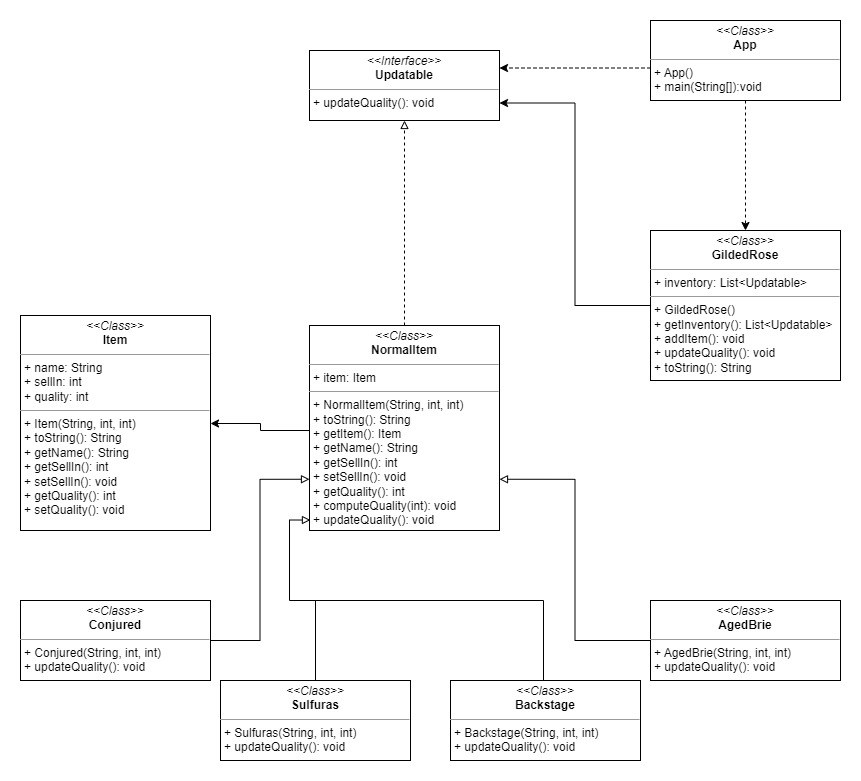

Gilded Rose kata
================

The code to refactor:

[Emily Bache Gilded Rose Kata - Java](https://github.com/emilybache/GildedRose-Refactoring-Kata/tree/master/Java)

Instructions:

[English](https://github.com/emilybache/GildedRose-Refactoring-Kata/blob/main/GildedRoseRequirements.txt)

[Spanish](https://github.com/emilybache/GildedRose-Refactoring-Kata/blob/main/GildedRoseRequirements_es.md)

## What is refactoring

Martin Fowler defines the refactoring technique as:

_"a change made to the internal structure of the software to make it easier to understand and cheaper to modify without changing its observable behavior”._

It is, without a doubt, the phrase that learned by heart, more health and happiness will bring to your life.

In the case of refactoring the logic of the _Gilded Rose_ shop magic products, per the _Code Complete_ guidelines:

 - _"Replace conditionals with polymorphism (especially repeated case statements):_
    - _Much of the logic that used to be contained in case statements in structured programs can instead be baked into the inheritance hierarchy and accomplished through polymorphic routine calls instead."_

 - A big refactoring is a recipe for disaster. —Kent Beck

That is to say: to avoid the complexity caused by nested `if-else` and their corresponding logical operators we are going to use polymorphism or the **Liskov Substitution Principle (LSP)** of the SOLID principles.

In addition, we will practice TDD by adding little by little test cases to avoid too large stages of refactoring that lead to a disaster.

### LSP - SOLID

We are going to apply polymorphism or the **Liskov Substitution Principle (LSP)** of the SOLID principles.

L of SOLID = [Liskov Substitution Principle](https://es.wikipedia.org/wiki/Principio_de_sustituci%C3%B3n_de_Liskov)

_"An abstract data type is implemented by writing a special class of program that defines the type in terms of the operations that can be performed on it"_. This is the **_duck typing_** interpretation.

_"Subtypes must be replaceable by their basic types"_. Martin C.Robert.

_"It is normally accepted that objects should be modified only through their methods (Encapsulation). As subtypes can introduce new methods, absent in the supertype, these could change the internal state of the object in ways that would be impossible or inadmissible in the supertype. The historical constraint prevents this type of modification."_

## UML class diagram

Use this UML class diagram to guide you through the implementation of the classes:

